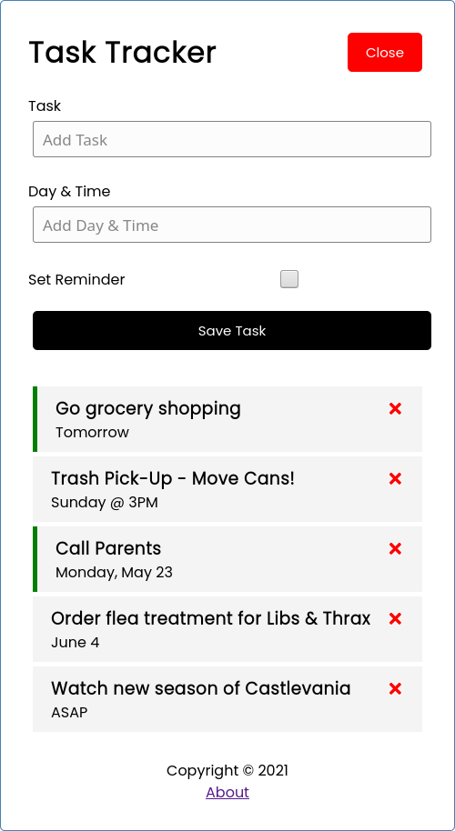

# Task Tracker
Task Tracker is a web application that users can use to create tasks.

## How It's Made
**Tech used:** CSS, JSX, JSON Server, and React  
**Lessons Learned:** I followed this full application build on YouTube to familiar myself with React. Thank you [Brad](https://traversymedia.com/), this was a big help.

